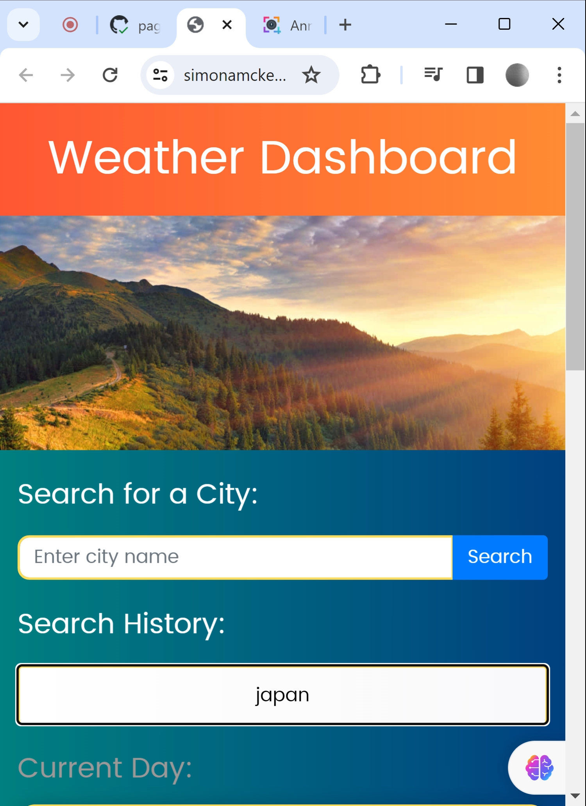

# Meteor Weather

## Overview

Meteor Weather is a cutting-edge web application designed to offer real-time weather updates for cities across the globe. With its modern and user-friendly interface, users can effortlessly access current weather conditions and a 5-day forecast for any chosen location.

### Core Features

- **Efficient Search:** Users can input a city name into the search bar to instantly receive accurate weather updates.

- **Responsive Layout:** The application is crafted to be responsive, ensuring a seamless experience on various devices, including desktops, tablets, and smartphones.

- **Search History:** Meteor Weather keeps track of search history, enabling users to quickly revisit and compare weather details for previously searched cities.

## Instructions

1. Input the name of a city in the search bar.
2. Click the "Search" button.
3. Explore the current weather and 5-day forecast for the entered city.
4. Quickly view the weather for previously searched cities by clicking on them in the search history.

## Application Scenarios

Meteor Insight is ideal for:

- Checking current weather conditions before stepping out.
- Planning upcoming trips and vacations.
- Monitoring weather in multiple cities for business or personal reasons.

## Snapshots

## Live Demonstration

[Live Demo](https://simonamckenzie.github.io/meteor_weather/)

[GitHub Repository](https://github.com/SimonAMcKenzie/meteor_weather)

## License

This project is licensed under the [MIT License](LICENSE).

## Badges

## Conclusion

Thank you for exploring Meteor Insight!
